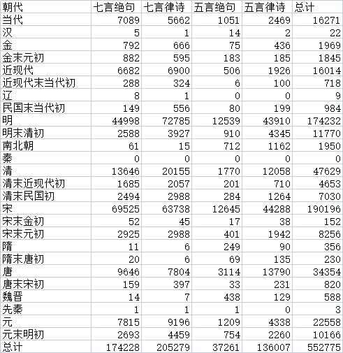

# GPT2 Chinese Poetry

## 致谢

项目参考了 [GPT2-Chinese](https://github.com/Morizeyao/GPT2-Chinese) 这个项目

训练数据为 [Poetry](https://github.com/Werneror/Poetry)，我只保留了其中的五言、七言的绝句和律诗，处理后共计 55 万首诗歌数据

向两个仓库的作者的贡献表示感谢。

## 数据

数据集 [Poetry](https://github.com/Werneror/Poetry) 处理过滤后的原始数据统计为：



训练数据 `train.csv` 格式为 `格式,主题,朝代,作者,藏头字,诗歌`，大小为 115 MB

我训练好的模型 `final_model/` 文件夹大小为 407 MB

我把两个文件放到了这里：

链接：https://pan.baidu.com/s/1s5V3c0bSqvmDQ_C5w8CXrg 
提取码：zvlj

下载后把 `train.csv` 放到 `data/` 目录下，把 `final_model.7z` 解压后放到 `model/` 目录下即可

## 介绍

- `train.py` 训练部分代码
- `generate.py` 生成部分代码
- `frontapp.py` 前端部分代码
- `/config` 模型参数配置，其中的 vocab_size 一定要设置成和选用词表大小相同
- `/model` 模型存放位置
- `/data` 训练原始数据及 tokenize 之后的数据存放位置
- `/vocab` 词表存放位置，本项目偷懒直接使用了 [GPT2-Chinese](https://github.com/Morizeyao/GPT2-Chinese) 项目提供的 `vocab_guwen.txt`，也可以自己根据原始数据生成词表，可能需要修改一下 `make_vocab.py` 文件
- `/tensorboard_summary` 存放了训练过程中 loss 的变化图，项目路径下运行 `tensorboard --logdir=tensorboard_summary` 即可查看

使用的关键库为 transformer 的 GPT2LMHeadModel 以及 tokenization_bert，GPT2LMHeadModel 用于创建 GPT-2 模型，tokenization_bert 用于分词。

处理过后的数据放在了 `data/train.csv`，训练时将语料处理成了 `格式[SEP]藏头字[SEP]诗歌内容` 的形式，故生成的时候可以通过指定开头为 `格式[SEP]藏头字` 来实现特定格式和特定藏头字的 trick

## 如何训练

运行 `python train.py` 后面加参数即可，具体参数及说明可通过 `python train.py --help` 查看

## 如何使用命令行生成

运行 `python generate.py` 后面加参数即可，这里给出如何限定题材和藏头字的示例：

`python ./generate.py --length=34 --nsamples=4 --prefix=七言绝句[SEP]风和日丽`

这里给出不同格式对应的长度参数：
- 七言律诗 65
- 五言律诗 50
- 七言绝句 34
- 五言绝句 26

生成的结果为：

```angular2html
======================================== SAMPLE 1 ========================================

七言绝句
风和日丽
风来水面漾清漪，和雨和烟上下迟。日暮归船归去好，丽华三月已开时。
======================================== SAMPLE 2 ========================================

七言绝句
风和日丽
风流人物竞争妍，和气氤氲上九天。日暖风和莺语滑，丽晴时节燕声喧。
======================================== SAMPLE 3 ========================================

七言绝句
风和日丽
风光一样异凡庸，和气氤氲散绮栊。日午笙歌喧百里，丽人队队舞春风。
======================================== SAMPLE 4 ========================================

七言绝句
风和日丽
风清帘幕晚生香，和气氤氲袭彩裳。日暖游丝飞不定，丽人无语自生凉。
================================================================================
```

## 如何使用前端体验

运行 `streamlit run .\frontapp.py` 并进入页面即可。

## todo[也许会鸽]

- 增加 诗歌风格 用于训练，例如“金戈铁马”、“赠友送别”。要获得风格数据训练，需要使用文本聚类等一系列分析方法。这样之后生成的时候也可以指定风格。
- 适配更多格式的诗句，不仅限于绝句（四句）和律诗（八句），这样藏头字就不会被限制只能为四字和八字

对于改进思路有建议的欢迎提 issue 或者 pr 交流